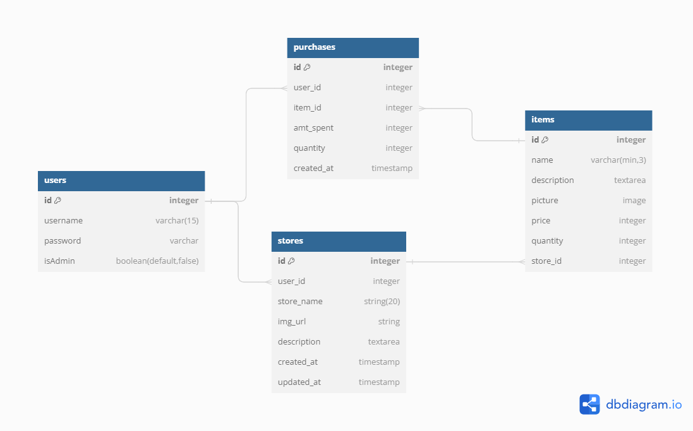

# Onwards Online Shopping
An online marketplace allowing shoppers to purchase items listed by store owners. Both store owners and shoppers will need their own account to sign in before they are able to view the website content. Store owners will have the ability to add/edit/delete stores and their respective store items. Store owners will be able to view a tablet showcasing all the purchases that were made from their stores. Store items will keep track of how many times it was purchases. Shoppers will have the ability to look through all the available stores and can view items for each store. Shoppers are also able to view their prior purchases.

This is a full stack application utilizing React as the frontend and Flask-SQLalchemy as the backend.

## Models

To run the react server:
npm run dev 

Note on the proxy in client/vite.config.js
You will need to add /api in front of all the fetch requests in order for the proxy to kick in, which is needed for authentication (cookies to be transmitted).

If your backend prefixes /api to all of your routes, for example: http://localhost:5555/api/check_session and you have api.add_resource(CheckSession, "/api/check_session"), you can remove the rewrite line which removes the /api from the route so you can use /api in your backend routes.

need help on:
page not found after refresh in production mode
works fine on development mode
maybe the reason: https://oliverjam.es/articles/avoid-spa-404

